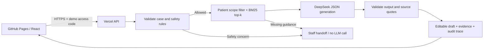

# SafeTriage — LLM + RAG teaching prototype

**[打开交互原型 · Open the prototype](https://wulifang332-afk.github.io/safetriage-prototype/)**

CA6117 AI for Healthcare: a clinician-supervised patient-message workbench with six fictional cases.

## Two modes

- **Demo:** the original deterministic scenarios, entirely in the browser. No API account or backend is required.
- **Live AI:** a protected backend retrieves relevant fictional sources with **BM25**, calls **DeepSeek**, validates citation IDs and exact quotes, then returns an editable draft for human review. You can edit the fictional message before running it.

The frontend stays on GitHub Pages; the production backend is `https://safetriage-api.vercel.app`. Live AI needs the deployed API URL, the project's demo access code and an active DeepSeek API balance. It does **not** require ChatGPT or a local server once the backend is deployed. The demo access code is different from the provider API key; the provider key stays on the server.

Open **Live AI / connection settings** and enter the demo access code. The production backend URL is prefilled; select a case and click **Run triage**. Use the **Evidence** tab and source buttons to inspect retrieval results and the exact text cited. Live and Demo keep separate browser histories. Reset demo clears the current mode's cases and activity.

## Architecture



The backend resolves the case from its own fictional fixture set. Clients cannot supply a patient record, system prompt, model name or arbitrary retrieval corpus. Other patients' records are excluded **before** retrieval scoring. The generation prompt receives only the selected patient's name/ID, the message/follow-up, and the retrieved excerpts.

RAG here uses lexical BM25 ranking, with small synonym normalization, across short versioned source documents. It is a working retrieval-augmented generation baseline, **not** an embedding/vector database implementation. Each short document is one retrieval chunk. Updating the source library and redeploying updates the index. For larger or multilingual corpora, evaluate semantic or hybrid retrieval separately.

## Workflow cases

| Fictional case | Workflow |
| --- | --- |
| Olivia Tan | Refill acknowledgement; clinician authorization still required |
| Daniel Lim | Configured urgent-symptom rule stops routine generation |
| Aisha Rahman | Clarification → patient follow-up → resume generation |
| Ethan Wong | Appointment confirmation using scoped record and policy |
| Grace Lee | Cross-patient/prompt override request blocked before retrieval |
| Marcus Teo | Missing procedure guidance → no unsupported generated reply |

The rule stops depend on message content, not scenario labels. A model cannot override a prior rule stop. It can additionally request staff review. The inbox shows the patient message and editable draft without a triage-summary card or right-hand panel. The bottom-right action row is ordered Approve, Reject, Escalate. Approve and Reject execute with one click. The sidebar contains Inbox and Escalations; there are no Review queue, Audit log, or Knowledge base pages in the UI. Source details remain available from the citation buttons. Sending and escalation are local demonstrations; no real message is transmitted to a patient or care team.

## Local development

Requires Node.js 24. The deployment runtime is pinned to this major version.

```sh
npm ci
cp .env.example .env.local
# Fill DEEPSEEK_API_KEY and a separate ACCESS_CODE in .env.local.
npm run api:dev
# In another terminal:
npm run dev
```

Use `http://127.0.0.1:8787` as the backend URL in the connection dialog, and enter your local `ACCESS_CODE`. The local backend allows the standard 5173/4173 preview origins. Keep all messages fictional.

```sh
npm test
npm run build
npm run preview
```

`npm run build` checks frontend and backend types, then builds the static frontend into `docs/`. GitHub Pages publishes **main → /docs**. Rebuild and commit `docs/` after changing frontend code. Do not put a secret in any `VITE_` variable; Vite embeds those variables into public assets.

## Deploy the backend

The repository includes `api/triage.ts`, `api/health.ts` and `vercel.json`. Vercel serves the API and a small status landing page; GitHub Pages remains the interactive frontend.

1. Create/link a Vercel project from this repository.
2. Set production environment variables using Vercel's server-side settings:
   - `DEEPSEEK_API_KEY` — sensitive server secret.
   - `ACCESS_CODE` — a separate private demo access code.
   - `LLM_MODEL` — `deepseek-flash` (configurable server-side).
   - `ALLOWED_ORIGIN` — `https://wulifang332-afk.github.io`.
3. Deploy the production backend. `GET /api/health` reports configuration state; it does not verify provider credit or reveal credentials.
4. Set the frontend's public `VITE_API_BASE_URL` to the deployed origin, run `npm run build`, then commit and push the generated `docs/` files. Alternatively enter the URL in connection settings.
5. Check a real model call after confirming the DeepSeek account has available credit.

Protect the demo access code when sharing the prototype. The server includes a small **per-instance** 12-request/minute limiter; it is not a distributed quota or guaranteed spend cap. Configure provider/platform spend controls for any broader deployment.

## Validation and limits

`npm test` exercises retrieval relevance, patient scoping, altered message input, rule stops, insufficient evidence, output parsing, hallucinated citations, exact-quote checks, API access, CORS and DeepSeek failure handling. Provider unit tests use a clearly labeled test generator; they are not evidence of live-model accuracy.

Actual model failures (invalid key, unavailable balance, timeout, malformed JSON, inconsistent citations) are surfaced explicitly and leave the case paused with no accepted draft. One bounded regeneration is allowed for malformed JSON, citation mismatch, or a prohibited output phrase; both attempts share a 45-second provider budget. The retry is recorded, and the second result must pass the same validation. Live mode never silently substitutes a scripted answer.

Citation checks verify source identity and exact quoted substrings. They **do not** prove that a model's claim follows from the quote, detect every hallucination, or establish clinical safety. The small English rule set is an illustrative safeguard, not validated medical triage. No patient authentication, real EHR integration, durable clinical audit store, clinical evaluation, or production compliance is provided.

All records, policies and messages are fictional teaching material. Do not use this project for clinical decisions or real patient data. Browser progress and audit records are local and editable; they are not an authoritative medical audit trail.

## Source map

- `components/safetriage/` — workbench, separate Demo/Live state, connection UI and evidence views
- `shared/triage.ts` — request/result contracts
- `server/knowledge.ts`, `server/rag.ts` — scoped corpus and BM25 retrieval
- `server/engine.ts` — input rules, grounded prompt, output/citation validation
- `server/provider.ts` — bounded DeepSeek request; API key stays server-side
- `server/http.ts`, `api/` — authenticated HTTP endpoints and Vercel entrypoints
- `server/engine.test.ts` — meaningful backend tests
- `docs/` — public frontend build

Third-party dependencies retain their licenses; the bundled shadcn styles include their license in `vendor/`.

API implementation follows the [DeepSeek Chat Completions documentation](https://api-docs.deepseek.com/api/create-chat-completion/) and [Vercel Node.js Functions documentation](https://vercel.com/docs/functions/runtimes/node-js).
